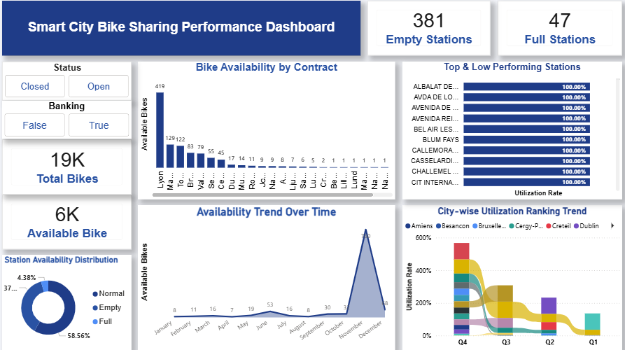

# 🚲 Smart City Bike Sharing Performance Dashboard

## 📌 Project Overview
This project focuses on data transformation, modeling, and visualization using Power BI to analyze bike-sharing station performance. The dashboard provides insights into station utilization, bike availability, and operational efficiency across cities.

The project demonstrates how Power BI can be used to clean, transform, and visualize real-world operational data for better decision-making.

---

## 🎯 Objective
The objective of this analysis is to evaluate station performance, availability patterns, and utilization efficiency using bike-sharing data. The goal is to derive actionable insights that support operational optimization and better resource allocation.

---

## 📂 Dataset Description
The dataset contains information related to bike-sharing stations including:

- Station Number
- Station Name
- Address
- Position (Latitude & Longitude)
- Banking
- Bonus
- Status
- Bike Stands
- Available Bike Stands
- Available Bikes
- Last Update (Date & Time)

This dataset represents station-level operational data of a bike-sharing system.

---

## 🧹 Data Cleaning & Transformation

### Station Information
- Renamed columns for clarity (number → Station Number, name → Station Name)
- Cleaned the Station Name column by removing numbers and unwanted symbols
- Standardized text formatting

### Address Column
- Identified missing values
- Replaced null values with **"Address Not Available"**

### Position Column
- Split the column into:
  - Latitude
  - Longitude
- Ensured correct data types for mapping

### Banking, Bonus & Status
- Converted columns to Text data type
- Standardized formatting

### Bike Stand Data
Converted the following columns to Whole Number:
- Bike Stands
- Available Bike Stands
- Available Bikes

### Last Update Column
- Converted DateTime with timezone to standard DateTime format
- Split into Date and Time columns

---

## 🧮 Custom Columns

### Occupancy Rate
```
Occupancy Rate = DIVIDE(SUM('Bike'[Available Bikes]), SUM('Bike'[Bike Stands]), 0)
```

### Availability Status
```
Availability Status =
IF([Available Bikes] = 0,"Empty",
IF([Available Bikes] = [Bike Stands],"Full","Normal"))
```

---

## 📊 DAX Measures

**Available Bike**
```
Available Bike = SUM(Bike[Available Bikes])
```

**Empty Stations**
```
Empty Stations =
CALCULATE(COUNT(Bike[Station Number]), Bike[Available Bikes] = 0)
```

**Full Stations**
```
Full Stations =
CALCULATE(COUNT(Bike[Station Number]),
Bike[Available Bikes] = Bike[Bike Stands])
```

**Estimated Revenue**
```
Estimated Revenue =
SUM(Bike[Available Bikes]) * 10
```

**Total Bikes**
```
Total Bikes = SUM(Bike[Bike Stands])
```

**Utilization Rate**
```
Utilization Rate =
DIVIDE(SUM(Bike[Available Bikes]), SUM(Bike[Bike Stands]))
```

---

## 📅 Calendar Table

A Calendar Table was created to support time-based analysis.

```
Calendar =
ADDCOLUMNS(
    CALENDAR(
        MIN('Bike'[Last Update]),
        MAX('Bike'[Last Update])
    ),
    "Year", YEAR([Date]),
    "Month Number", MONTH([Date]),
    "Month Name", FORMAT([Date], "MMMM"),
    "Year-Month", FORMAT([Date], "YYYY-MM"),
    "Quarter", "Q" & FORMAT([Date], "Q"),
    "Day", DAY([Date])
)
```

A Many-to-One relationship was created between the Bike table and Calendar table.

---

## 📊 Dashboard Features

The Power BI dashboard includes:

- Station utilization analysis
- Bike availability monitoring
- Availability status distribution
- Time-based availability trends
- Geographic station analysis

---

## 🔍 Key Insights

🚲 **Station Performance**  
Some stations show 100% utilization while others are completely empty, indicating supply imbalance.

🏙 **Contract-wise Analysis**  
Certain contracts show consistently higher utilization.

📈 **Trend Analysis**  
Bike availability shows seasonal fluctuations with peak periods in specific months.

📊 **Distribution**  
Most stations operate under Normal conditions, while fewer stations fall under Full or Empty categories.

---

## 💡 Recommendations

- Redistribute bikes from Full stations to Empty stations
- Monitor underperforming locations
- Implement predictive demand forecasting
- Apply dynamic bike redistribution strategies during peak demand

---

## ✅ Conclusion
The Power BI dashboard provides a comprehensive analysis of bike-sharing station performance. The insights help improve urban mobility management and operational efficiency through data-driven decision making.

---

## 🛠 Tools Used
- Power BI
- Power Query
- DAX
- Data Modeling
- Data Visualization

---

## 📊 Dashboard Preview


